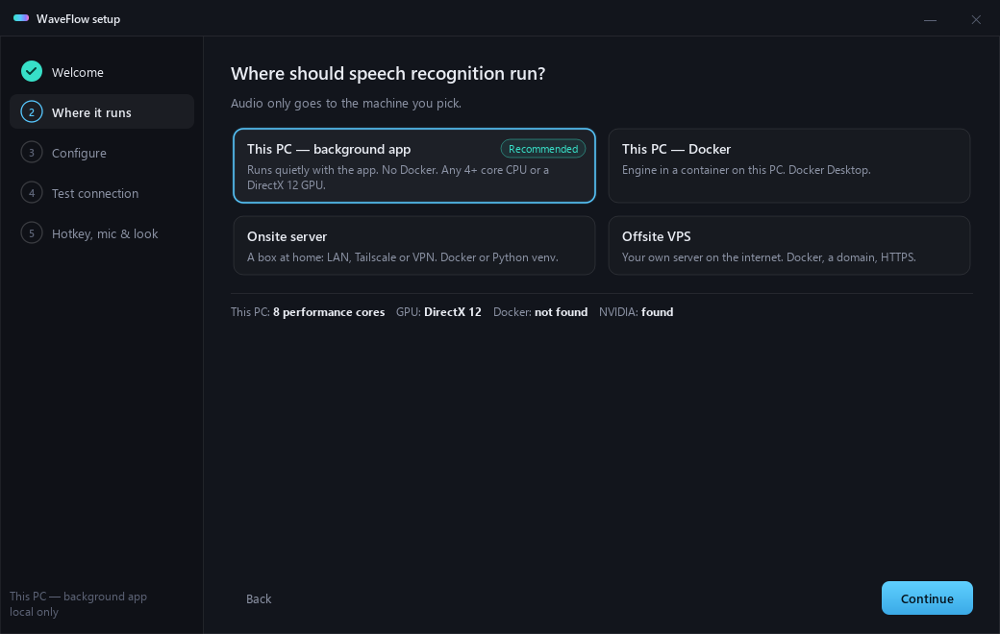
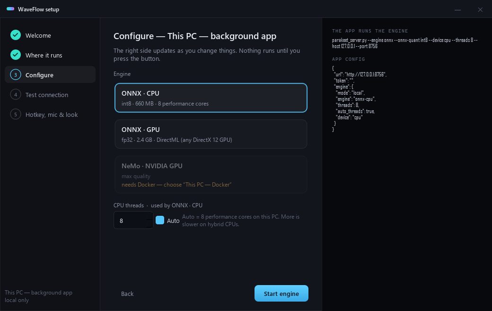
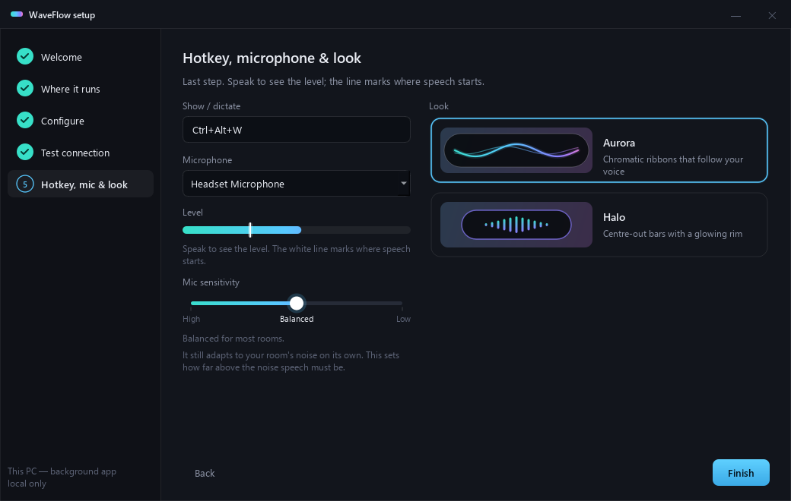
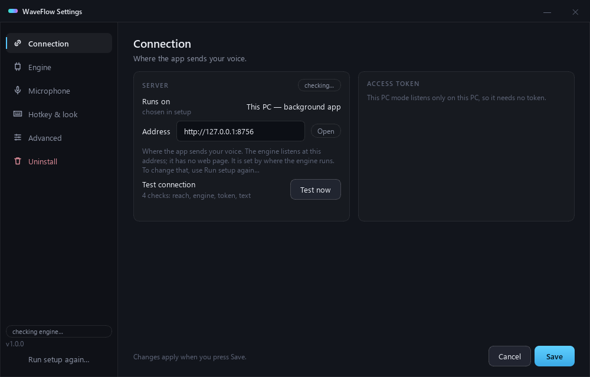
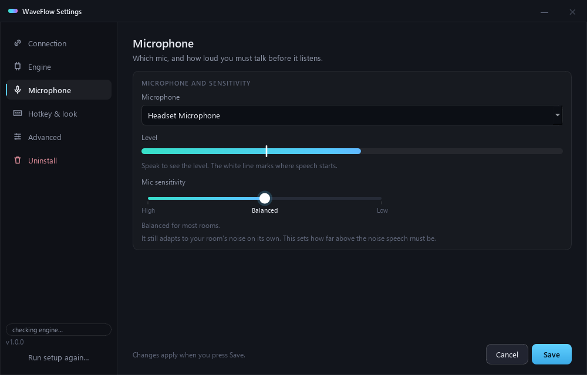
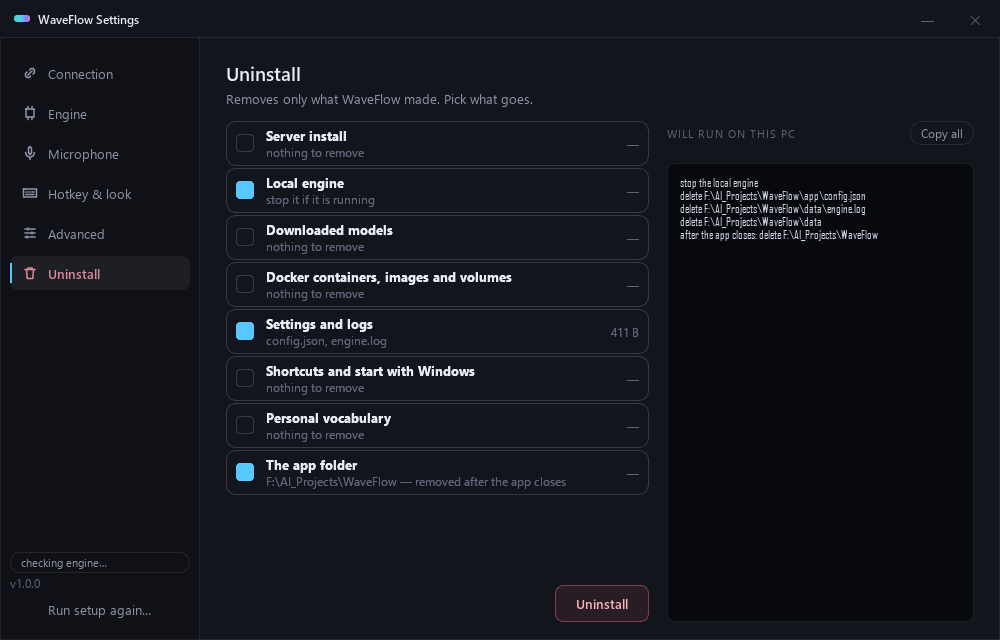

<p align="center">
  
</p>

Private, local voice dictation for Windows. Press a hotkey, talk, and the words type live into
whatever text box has focus. Speech recognition runs on **your** hardware — this PC, a server
in your house, or your own VPS. Nothing goes to a cloud service.

Engine: NVIDIA **Parakeet TDT 0.6B v2** (English), via ONNX Runtime (default) or NVIDIA NeMo.

> Status: v1. Windows client only. English only.

## Why WaveFlow

Most local dictation apps run the engine on the machine you type on. WaveFlow can, but it does not
have to: point it at a box that has the GPU, and dictate from a thin laptop.

| | Typical local dictation app | WaveFlow |
|---|---|---|
| Where the engine runs | this PC only | this PC, a server in your house, or your own VPS |
| Setting up that server | you do it by hand | the wizard installs it **over SSH** and tests it |
| Reaching it from outside | — | token required; the server refuses a non-loopback bind without one |
| While you speak | usually types everything at the end | types as you talk, and **never rewrites what it already typed** |
| Removing it | leaves files behind | lists everything it installed, removes only that, server included |
| Numbers in this README | "3x faster" | measured, with the commands to repeat them |

It is GPL-3.0, English-only, Windows-only today, and the engine is NVIDIA Parakeet TDT 0.6B v2 —
not Whisper.

## What it looks like

The overlay while you talk — two skins, switch any time in Settings:

<p align="center"></p>

| Setup wizard — where the engine runs | Configure and start it |
|---|---|
|  |  |

| Hotkey, microphone and look | Settings — connection |
|---|---|
|  |  |

| Microphone and sensitivity | Uninstall: everything it made, nothing else |
|---|---|
|  |  |

---

## Pick a setup

Start the app and the **setup wizard** walks you through one of these:

| Where the engine runs | Section | Needs | Token | The wizard… | Tested |
|---|---|---|---|---|---|
| **This PC — background app** (easiest) | [A](#a-this-pc--background-app-onnx) | Any 4+ core CPU, or a DirectX 12 GPU | not needed (local only) | starts the engine for you | ✅ CPU and DirectML GPU |
| **This PC — Docker** | [B](#b-this-pc-or-onsite-server--docker) | Docker Desktop | required | builds and starts the container | ⚠️ not tested |
| **Onsite server** (LAN, Tailscale, VPN) — Docker | [B](#b-this-pc-or-onsite-server--docker) | A Linux box with Docker, SSH access | required | **installs it over SSH** | ✅ NeMo on GTX 1060/1080 |
| **Onsite server** — Python venv | [C](#c-onsite-server--python-venv) | Python 3.12 | required | shows the commands to run | ✅ ONNX |
| **Offsite VPS** — Docker + HTTPS | [D](#d-offsite-vps--docker--https) | A VPS and a domain name | required | **installs it over SSH** | ⚠️ not tested |

⚠️ **Not tested yet:** *This PC — Docker* (no Docker Desktop on the test machine) and *VPS* (no VPS).
The code paths exist and share the tested parts, but nobody has run them end to end. If you try
one, please open an issue with what happened, or send a pull request with the fix.

The server listens on `127.0.0.1` (this machine only) by default. It **refuses to start** on any
other address without a token.

## Engines

| Engine | Device | Model size | Seconds to re-read 5 / 10 / 20 s of speech | Memory |
|---|---|---|---|---|
| ONNX int8 (default) | CPU — Intel Core Ultra 7 270K, 4 threads | ~660 MB | 0.14 / 0.31 / 0.64 | ~1.5 GB RAM |
| ONNX int8 | CPU — Intel i7-7700K (2017), 4 threads | ~660 MB | 0.33 / 0.59 / 1.17 | ~1.5 GB RAM |
| ONNX fp32 | GPU — DirectML on Windows (RTX 5070 Ti) | ~2.4 GB | 0.20 / 0.21 / 0.25 | ~2.5 GB VRAM |
| ONNX fp32 | GPU — CUDA on Linux | ~2.4 GB | not measured | ~2.5 GB VRAM |
| NeMo fp16 ("max quality") | NVIDIA GPU, Docker only (GTX 1060) | ~1.2 GB | 0.11 / 0.15 / 0.24 | ~1.6 GB VRAM, ~1.2 GB RAM, 10.7 GB image |

Live mode re-reads the current sentence about every 0.7 s. On a slower machine it slows that
pace down by itself. An old 4-core CPU keeps up well for sentences up to ~10 s.

**CPU threads:** set `--threads` to your number of **physical performance cores**. Do not count
hyperthreads or efficiency cores. On a hybrid Intel CPU, all 24 threads ran ~4x slower than 4, and
8 (its performance cores) was ~20% faster than 4. Changing threads in Settings needs **no app
restart**: Save restarts only the engine, about 5 seconds with the model already downloaded.

**Long sessions:** a 5-minute real-time replay on CPU (4 threads) kept the same re-read time from
start to end (~150 ms) and never rewrote typed text.

**Old NVIDIA GPUs (Pascal, GTX 10xx) with ONNX CUDA:** use Python 3.12,
`onnxruntime-gpu==1.23.2` and `nvidia-cudnn-cu12==9.1.0.70`. Newer cuDNN fails on Pascal. The
NeMo Docker image already works on Pascal.

---

## A. This PC — background app (ONNX)

```powershell
git clone <this repo> WaveFlow
cd WaveFlow
py -3.12 -m venv venv
venv\Scripts\pip install -r requirements.txt
venv\Scripts\python app\waveflow.py
```

On first start the **setup wizard** opens. Pick *This PC — background app*, choose **ONNX · CPU**
or **ONNX · GPU**, set CPU threads (Auto = your performance cores), and press **Start engine**.
The app then starts and stops the engine itself. The GPU engine needs the DirectML build of ONNX
Runtime; the wizard's *Install GPU support* button swaps it in.

You can close the terminal: the app moves itself to the background. Finishing setup adds
**WaveFlow** to the Start menu and the desktop — start it from there after that. Everything it
downloads or writes (model, logs, settings) stays inside the `WaveFlow` folder.

Without the wizard, run the engine by hand:

```powershell
# CPU:
venv\Scripts\python server\parakeet_server.py --engine onnx --onnx-quant int8 --device cpu --threads 4
# or GPU (DirectML):
venv\Scripts\pip uninstall -y onnxruntime
venv\Scripts\pip install onnxruntime-directml
venv\Scripts\python server\parakeet_server.py --engine onnx --onnx-quant fp32 --device dml
```

Default hotkey: `Ctrl+Alt+W`.

**Settings** (⚙ or the tray icon → Settings…): connection and token (show, copy, rotate), engine
and CPU threads, microphone with a live level meter and a sensitivity slider, hotkey, Live or
Burst mode, stop-after-silence, start with Windows, overlay skin, debug recording, vocabulary,
**Uninstall**, and *Run setup again…*.

The `.exe` build cannot start the engine itself yet — use it with Docker or a remote server.

## B. This PC or onsite server — Docker

**With the wizard (onsite server):** choose *Onsite server*, type the server address and your SSH
user, pick an engine, and press **Install on <server>**. The wizard connects with **your SSH key**
(it never asks for or stores a password), checks Docker, the GPU and free disk, copies the server
files, writes `docker/.env` with the token, starts the container, and runs *Test connection*. The
token is also saved in Settings → Connection for reinstalling or reconnecting. If the server
rejects your key, the wizard shows how to add it (`ssh-keygen`, `ssh-copy-id`).

The server needs Docker usable by your user (`sudo usermod -aG docker <user>`), and for GPU
engines the NVIDIA driver and the NVIDIA Container Toolkit. Images are named
`waveflow-onnx:cpu`, `waveflow-onnx:gpu` and `waveflow-nemo:slim`.

**By hand:**

```bash
cd docker
python -c "import secrets; print('WAVEFLOW_TOKEN=' + secrets.token_urlsafe(32))" > .env
echo "HOST_BIND=127.0.0.1" >> .env     # 0.0.0.0 = reachable from your network
echo "THREADS=4" >> .env
docker compose -f compose.yml up -d --build                  # ONNX on CPU, port 8756
docker compose -f compose.yml --profile nemo up -d --build   # + NeMo on NVIDIA GPU, port 8757
```

NeMo needs the [NVIDIA Container Toolkit](https://docs.nvidia.com/datacenter/cloud-native/container-toolkit/)
and ~20 GB free disk while it builds.

In the client `app/config.json`: `"url": "http://<server>:8756"` and `"token": "<your token>"`.

## C. Onsite server — Python venv

```bash
python3.12 -m venv venv && venv/bin/pip install -r requirements-server.txt
export WAVEFLOW_TOKEN="$(python3 -c 'import secrets;print(secrets.token_urlsafe(32))')"
venv/bin/python server/parakeet_server.py --engine onnx --host 0.0.0.0 --threads 4
```

Use a private network (LAN, Tailscale, WireGuard). Plain HTTP sends audio unencrypted. For
anything outside your own network, use D.

## D. Offsite VPS — Docker + HTTPS

1. Point a DNS name at the VPS (for example `stt.example.com`).
2. Create `docker/.env`:
   ```
   WAVEFLOW_DOMAIN=stt.example.com
   WAVEFLOW_TOKEN=<long random string>
   ```
3. `docker compose -f docker/compose.vps.yml up -d --build`
4. In the client: `"url": "https://stt.example.com"` and the same token.

Caddy gets the HTTPS certificate by itself. Only ports 80 and 443 are open. The engine port is not.

---

## Your own words (vocabulary)

The model does not know your names and jargon. Copy `server/vocab.example.json` to
`server/vocab.user.json` (or set `WAVEFLOW_VOCAB` to a path), then add how the model
mis-hears each word. Restart the server. `vocab.user.json` is git-ignored.

## Privacy and security

- Audio goes only to the server URL you set. No telemetry.
- Server default: `127.0.0.1`. Any other address needs `--token` or `WAVEFLOW_TOKEN`.
  `--allow-no-token` turns that off. Use it only on a network you fully trust.
- The client sends the token as `Authorization: Bearer <token>`. It is never written to logs.
- Recording is **off**. `--record <dir>` (or `"record"` in `config.json`) saves session audio,
  for debugging only.

## Uninstall

Settings → **Uninstall**. It lists everything WaveFlow installed, with sizes, and the exact
steps before it runs anything:

- the engine, the downloaded model, settings and logs, shortcuts and the start-with-Windows entry,
  its own Docker containers, images and volumes, and the app folder (deleted after the app closes);
- **a server the wizard installed over SSH**: its container, image, volume and install folder,
  removed over SSH with your key.

It never removes what WaveFlow did not install, or what something else still uses: Python,
Docker itself, a Hugging Face cache of your own, base images other containers use, or Docker's
shared build cache. Your personal vocabulary is kept unless you tick it (it lives in the app
folder, so ticking the app folder removes it too — the list says so).

Without the app: `venv\Scripts\python app\uninstall.py --dry-run` lists the same steps.

## Build the .exe

```powershell
venv\Scripts\pip install pyinstaller
venv\Scripts\python app\build.py      # -> dist\WaveFlow.exe
```

## Tests

```bash
python server/test_live_settle.py   # LIVE_SETTLE_OK
python server/test_auth.py          # AUTH_OK
python server/vocab.py              # VOCAB_OK
python app/test_wizard.py           # WIZARD_OK    (setup rules, SSH install)
python app/test_settings.py         # SETTINGS_OK  (settings, meter, icons)
python app/test_uninstall.py        # UNINSTALL_OK
```

## Licences

WaveFlow code: **[GNU GPL v3](LICENSE)** — free to use and change; if you give a changed
version to other people, publish your source under GPL v3 too. Third-party parts:
[NOTICE.md](NOTICE.md).
The Parakeet model is **CC-BY-4.0** (NVIDIA; ONNX conversion by istupakov). Credit them if you
redistribute it.
